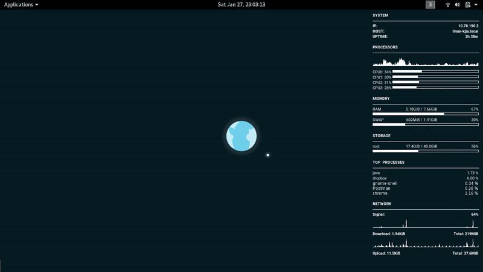

<h1 align="center">🎀 System Stats Widget for Linux</h1>
<p align="center">
  <i>A minimal conky configuration to show real-time system resource usage on Linux</i>
</p>

<br>

<p align="center"><p>


### About
This conky widget aims to show vital system stats at a glance, while also being simple, minimal and lightweight.

[Conky](https://github.com/brndnmtthws/conky) is an open source, light-weight system monitor for X. It's easy to write widgets for, and can be used to display any kind of data directly on your desktop. For more info, see the [Conky Wiki on GitHub](https://github.com/brndnmtthws/conky/wiki)

### Installation
Firstly, if you haven't already - then install Conky for your system. See the [Installation Wiki](https://github.com/brndnmtthws/conky/wiki/Installation) for distro-specific instructions.

Then download [`minimal-system-conky.conf`](https://raw.githubusercontent.com/Lissy93/conky-system-stats-widget/master/minimal-system-conky.conf), and pass it to conky, with the `--config` flag. e.g:

```bash
mkdir -p ~/.config/conky/
curl -o ~/.config/conky/minimal-system-conky.conf  \
  https://raw.githubusercontent.com/Lissy93/conky-system-stats-widget/master/minimal-system-conky.conf
conky --config ~/.config/conky/minimal-system-conky.conf
```


### Contributing
If you have an improvement that you'd like to make, feel free to submit a pull request.

---

<p  align="center">
  <i>© <a href="https://aliciasykes.com">Alicia Sykes</a> 2018</i><br>
  <i>Licensed under <a href="https://gist.github.com/Lissy93/143d2ee01ccc5c052a17">MIT</a></i><br>
  <a href="https://github.com/lissy93"></a>
</p>
